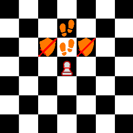

# Chess Evolved 2

Toto je GUI pre šachovú hru s neštandardnými šachovými pravidlami. Pre túto hru bol vytvorený šachový engine [Malakh](https://github.com/MS-101/Malakh).

## Esencie

Táto hra používa herný systém esencií. Všetky figúrky okrem kráľovnej a kráľa sa dajú vylepšiť s esenciou. Esencia pridáva figúrke dodatočné mobility.

### Pešiak

  

### Kôň

  

### Strelec

  

### Veža

  
